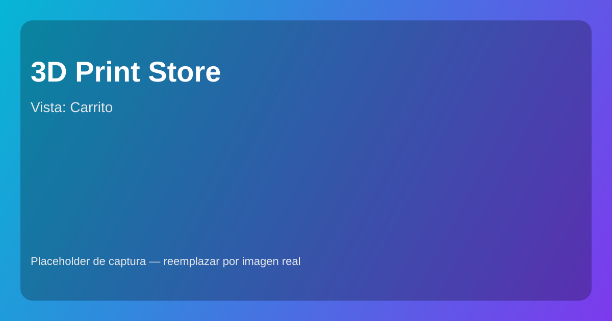
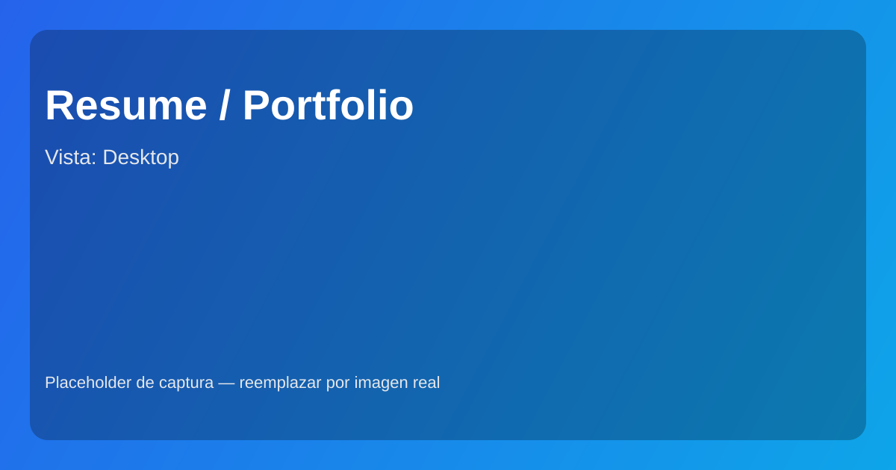
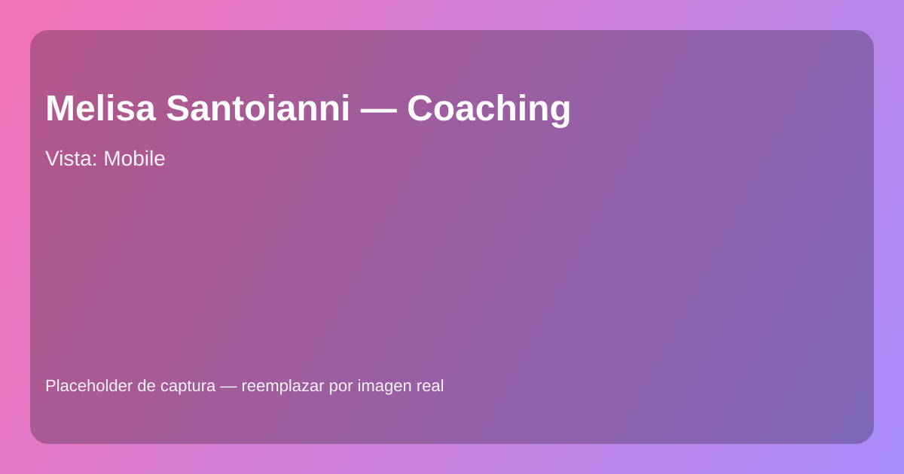

### ¡Hola! Soy Nicolás Matías Barra Pelecano

Apasionado del desarrollo full‑stack con orientación educativa. Actualmente curso la Tecnicatura Superior en Ciencia de Datos e Inteligencia Artificial. Cuento con base sólida en Python, Django y JavaScript, experiencia enseñando programación y desarrollando proyectos web. Busco mi primera oportunidad laboral en IT para aprender, crecer y aportar en entornos de innovación.

- **Ubicación**: Mar del Plata, Buenos Aires
- **Contacto**: [nicolasbarrapelecano@gmail.com](mailto:nicolasbarrapelecano@gmail.com) · [WhatsApp/Teléfono](tel:+542266440616)
- **Disponibilidad**: Tiempo completo · Remoto

## Tecnologías

## Perfil profesional

Soy un entusiasta del desarrollo full‑stack con orientación educativa. Manejo Python, Django y JavaScript; disfruto de transformar ideas en productos web y de acompañar a otros en su proceso de aprendizaje. Me motiva la mejora continua, el trabajo en equipo y el diseño de soluciones simples y mantenibles.

## Experiencia en educación y desarrollo

- **Profesor de Python (Freelance) — Zinkgular, España** (Abr 2024 — Actualidad)
  - Clases prácticas de nivel inicial e intermedio.
  - Enfoque en resolución de problemas y desarrollo de aplicaciones.

- **Tutor de Desarrollo — Coderhouse** (Ene 2022 — Sep 2024)
  - Acompañamiento a estudiantes en Python, Django y JavaScript.
  - Corrección de ejercicios y guía en proyectos web integrales.

- **Facilitador de Aprendizaje — Junior Achievement Argentina** (May 2022 — Jul 2022)
  - Capacitación docente a nivel nacional en desarrollo web.
  - Implementación de programas educativos orientados a programación.

## Educación

- **Tecnicatura Superior en Ciencia de Datos e Inteligencia Artificial** — ISFT N.º 204, Mar del Plata  
  Desde marzo 2025 (Primer año en curso). Todas las materias cursadas hasta el momento han sido promocionadas.

## Certificaciones relevantes

- Scrum Foundation — CertiProf, 2023
- Python Essentials 1 — Cisco Networking Academy, 2023
- Diplomatura en Python Nivel 1 — UTN FRBA, 2023
- Desarrollo Web Full‑Stack con Python y Django — Coderhouse, 2021
- Gobernanza de Datos e Inteligencia Artificial — UBA, 2023

## Proyectos destacados

- **3D Print Store — Catálogo Online**  
  Catálogo moderno y responsive con carrito (Context API) e integración a WhatsApp para pedidos.  
  Stack: Next.js 14, TypeScript, Tailwind CSS.  
  Código: https://github.com/nikobarra/niko3d · Demo: https://niko3d.vercel.app
  
  Capturas:
  
  
  

- **Resume**  
  Repositorio de mi CV/Resume para facilitar descarga y consulta en línea.  
  Código: https://github.com/nikobarra/resume URL: https://nicolasbarra.dev/
  
  Capturas:
  
  

- **Melisa Santoianni — Coaching**  
  Sitio estático optimizado para Vercel orientado a bienestar y coaching personal.  
  Stack: HTML, CSS, JavaScript.  
  Código: https://github.com/nikobarra/melisa_santoianni_coaching · URL: https://www.melisantoianni.com/
  
  Capturas:
  
  
  

> Nota: Coloca las imágenes en `assets/capturas/` dentro de este repositorio para que se muestren correctamente en tu perfil.

## Estadísticas de GitHub

## Cómo puedo aportar a tu equipo

- Mentalidad de aprendizaje continuo y foco en calidad de código.
- Comunicación clara y experiencia docente/tutoría.
- Orientación a resultados y trabajo remoto efectivo.

## Contacto

- 📧 Correo: [nicolasbarrapelecano@gmail.com](mailto:nicolasbarrapelecano@gmail.com)
- 📱 Teléfono/WhatsApp: [+54 2266 440616](tel:+542266440616)

—

Este README está pensado para el repositorio de perfil [`nikobarra/nikobarra`](https://github.com/nikobarra/nikobarra). Al publicarlo allí, se mostrará automáticamente en tu perfil de GitHub.

