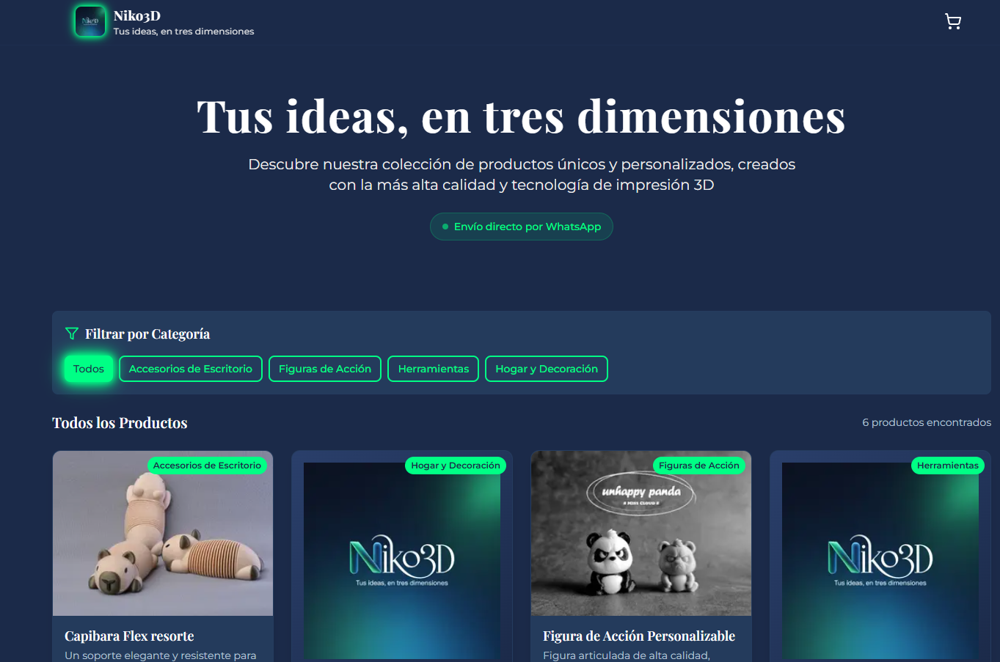
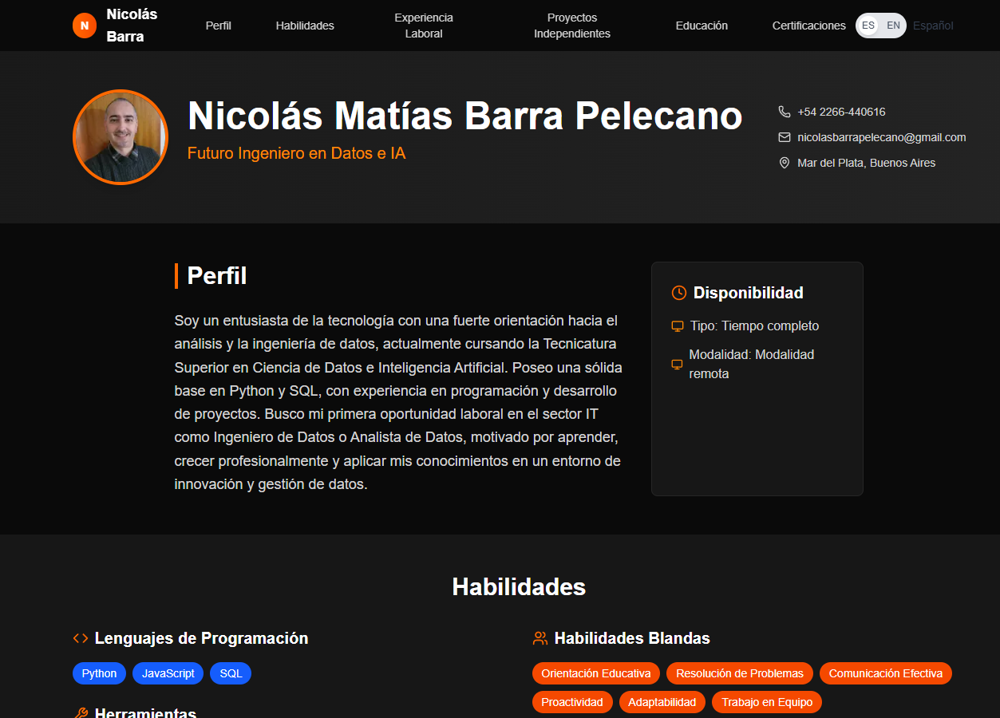
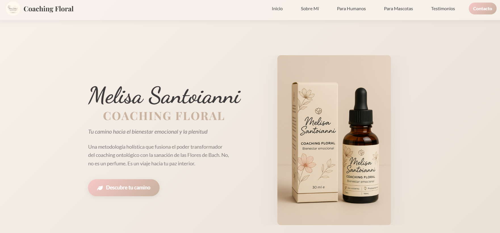
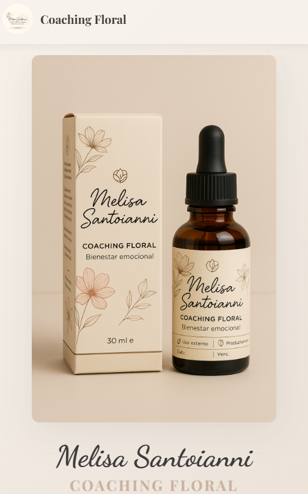

### Hi there! I'm Nicolás Matías Barra Pelecano

Passionate full‑stack developer with a knack for teaching. Currently pursuing a Technical Degree in Data Science and Artificial Intelligence. I'm well-versed in Python, Django, and JavaScript, with hands-on experience teaching programming and building web projects. Looking to break into the tech industry where I can learn, grow, and make a meaningful impact in innovative environments.

- **Location**: Mar del Plata, Buenos Aires
- **Contact**: [nicolasbarrapelecano@gmail.com](mailto:nicolasbarrapelecano@gmail.com)

## Tech Stack

## Professional Profile

I'm a full‑stack development enthusiast with a passion for education. I work with Python, Django, and JavaScript; I love turning ideas into real-world web products and helping others along their learning journey. What drives me is continuous improvement, collaborative work, and crafting clean, maintainable solutions.

## Education & Development Experience

- **Python Instructor (Freelance) — BeWise, Spain** (Apr 2024 — Present)
  - Hands-on classes for beginners and intermediate learners.
  - Focused on problem-solving and application development.

- **Development Tutor — Coderhouse** (Jan 2022 — Sep 2024)
  - Mentored students in Python, Django, and JavaScript.
  - Reviewed assignments and guided them through full-stack web projects.

- **Learning Facilitator — Junior Achievement Argentina** (May 2022 — Jul 2022)
  - Delivered nationwide teacher training in web development.
  - Rolled out educational programs focused on programming.

## Education

- **Technical Degree in Data Science and Artificial Intelligence** — ISFT N.º 204, Mar del Plata  
  Started March 2025 (First year in progress). All coursework completed so far has been passed with top marks.

## Relevant Certifications

- Scrum Foundation — CertiProf, 2023
- Python Essentials 1 — Cisco Networking Academy, 2023
- Python Level 1 Diploma — UTN FRBA, 2023
- Full‑Stack Web Development with Python and Django — Coderhouse, 2021
- Data Governance and Artificial Intelligence — UBA, 2023

## Featured Projects

- **3D Print Store — Online Catalog**  
  Modern, responsive catalog featuring a shopping cart (Context API) and WhatsApp integration for orders.  
  Stack: Next.js 14, TypeScript, Tailwind CSS.  
  Code: https://github.com/nikobarra/niko3d · Live: https://niko3d.vercel.app
  
  Screenshots:
  
  
  

- **Resume**  
  Personal CV/Resume repository for easy download and online viewing.  
  Code: https://github.com/nikobarra/resume · Live: https://nicolasbarra.dev/
  
  Screenshots:
  
  

- **Melisa Santoianni — Coaching**  
  Static site built for Vercel, focused on wellness and personal coaching.  
  Stack: HTML, CSS, JavaScript.  
  Code: https://github.com/nikobarra/melisa_santoianni_coaching · Live: https://www.melisantoianni.com/
  
  Screenshots:
  
  
  

## What I Bring to the Table

- Growth mindset with a keen eye for code quality.
- Clear communication skills backed by teaching and mentoring experience.
- Results-driven approach and proven track record in remote work.

## Get in Touch

- 📧 Email: [nicolasbarrapelecano@gmail.com](mailto:nicolasbarrapelecano@gmail.com)
- 📱 Phone/WhatsApp: [+54 2266 440616](tel:+542266440616)

